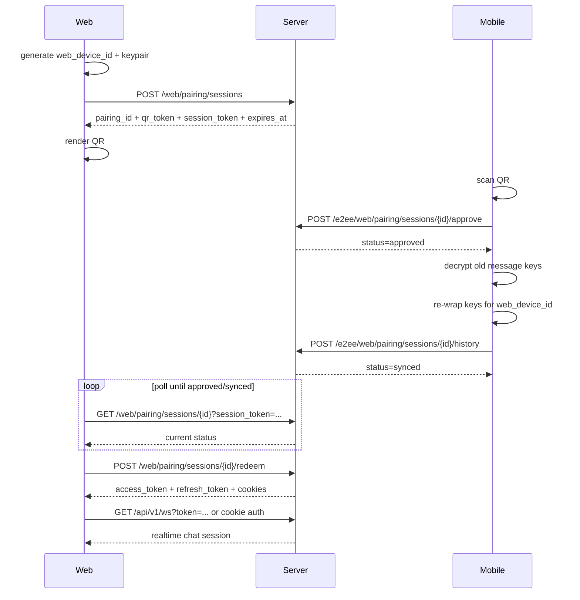

# E2EE Web Pairing Frontend Contract

## Назначение

Этот документ описывает точный клиентский flow для:

- `web -> create QR pairing session`
- `mobile -> approve / reject`
- `mobile -> history key re-wrap`
- `web -> redeem linked session`

Документ соответствует текущему backend MVP.

## Общая модель

- `web` считается отдельным устройством
- `mobile` считается уже доверенным устройством
- `server` не расшифровывает сообщения и не знает plaintext
- `history sync` передаёт только новые wrapped message keys для `web_device_id`

## Статусы pairing session

- `pending` — QR создан, ждём scan/approve
- `approved` — mobile подтвердил устройство
- `synced` — history sync завершён или помечен завершённым
- `redeemed` — web обменял `session_token` на backend session
- `revoked` — pairing отклонён или отозван
- `expired` — QR/session истекли

## Endpoint Summary

Публичные:

- `POST /api/v1/web/pairing/sessions`
- `GET /api/v1/web/pairing/sessions/{pairing_id}?session_token=...`
- `POST /api/v1/web/pairing/sessions/{pairing_id}/redeem`

Защищённые:

- `POST /api/v1/e2ee/web/pairing/sessions/{pairing_id}/preview`
- `POST /api/v1/e2ee/web/pairing/sessions/{pairing_id}/approve`
- `POST /api/v1/e2ee/web/pairing/sessions/{pairing_id}/reject`
- `POST /api/v1/e2ee/web/pairing/sessions/{pairing_id}/history`
- `GET /api/v1/e2ee/devices`
- `DELETE /api/v1/e2ee/devices/{device_id}`

## Sequence Diagram



## 1. Web Init

### Request

`POST /api/v1/web/pairing/sessions`

```json
{
  "web_device_id": "8aefdb5f-1a1a-4316-a8fa-9067fd3eb0c7",
  "web_public_key": "base64-x25519-public-key",
  "web_ephemeral_pub": "base64-optional-ephemeral-key",
  "ttl_seconds": 90
}
```

### Response

```json
{
  "pairing_id": "0f8b76fb-0ec8-46a5-aa2e-d6a74fd2f38f",
  "qr_token": "opaque-qr-token",
  "session_token": "opaque-session-token",
  "web_device_id": "8aefdb5f-1a1a-4316-a8fa-9067fd3eb0c7",
  "web_public_key": "base64-x25519-public-key",
  "web_ephemeral_pub": "base64-optional-ephemeral-key",
  "status": "pending",
  "expires_at": "2026-03-28T09:30:00Z",
  "qr_payload": {
    "type": "web_pairing",
    "pairing_id": "0f8b76fb-0ec8-46a5-aa2e-d6a74fd2f38f",
    "qr_token": "opaque-qr-token",
    "web_device_id": "8aefdb5f-1a1a-4316-a8fa-9067fd3eb0c7",
    "web_public_key": "base64-x25519-public-key",
    "web_ephemeral_pub": "base64-optional-ephemeral-key",
    "expires_at": "2026-03-28T09:30:00Z"
  }
}
```

### Frontend behavior

- сгенерировать device keypair локально
- сохранить private key в `IndexedDB`
- не сохранять private key в `localStorage`
- в QR кодировать именно `qr_payload`
- `session_token` не показывать в QR и не передавать мобильному

## 2. Web Poll Status

### Request

`GET /api/v1/web/pairing/sessions/{pairing_id}?session_token=opaque-session-token`

Допустимо передавать `session_token` через header `X-Session-Token`.

### Response

```json
{
  "pairing_id": "0f8b76fb-0ec8-46a5-aa2e-d6a74fd2f38f",
  "web_device_id": "8aefdb5f-1a1a-4316-a8fa-9067fd3eb0c7",
  "status": "approved",
  "approved": true,
  "synced": false,
  "redeemed": false,
  "expires_at": "2026-03-28T09:30:00Z",
  "approved_at": "2026-03-28T09:29:10Z"
}
```

### Frontend behavior

- пока `status = pending`, продолжать poll
- если `status = approved`, ждать `synced` или разрешать `redeem` сразу
- если `status = revoked` или `expired`, показывать ошибку и предлагать новый QR

Рекомендация:

- poll каждые `2-3 секунды`
- остановить poll после `redeemed`, `revoked`, `expired`

## 3. Mobile Approve

### Preview before approve

`POST /api/v1/e2ee/web/pairing/sessions/{pairing_id}/preview`

```json
{
  "qr_token": "opaque-qr-token"
}
```

Response:

```json
{
  "pairing_id": "0f8b76fb-0ec8-46a5-aa2e-d6a74fd2f38f",
  "web_device_id": "8aefdb5f-1a1a-4316-a8fa-9067fd3eb0c7",
  "web_public_key": "base64-x25519-public-key",
  "request_ip": "203.0.113.10",
  "request_country": "KZ",
  "request_city": "Almaty",
  "request_user_agent": "Mozilla/5.0 ... Chrome/136.0",
  "expires_at": "2026-03-28T09:30:00Z",
  "status": "pending",
  "created_at": "2026-03-28T09:28:55Z"
}
```

Mobile UI может использовать это для экрана подтверждения:

- браузер/OS
- IP
- страна/город, если прокси передал geo headers
- время создания запроса

## 4. Mobile Approve

### Request

`POST /api/v1/e2ee/web/pairing/sessions/{pairing_id}/approve`

```json
{
  "qr_token": "opaque-qr-token",
  "web_device_id": "8aefdb5f-1a1a-4316-a8fa-9067fd3eb0c7",
  "web_public_key": "base64-x25519-public-key",
  "device_name": "Chrome on MacBook Pro",
  "platform": "web",
  "history_sync": true
}
```

### Response

```json
{
  "pairing_id": "0f8b76fb-0ec8-46a5-aa2e-d6a74fd2f38f",
  "web_device_id": "8aefdb5f-1a1a-4316-a8fa-9067fd3eb0c7",
  "status": "approved",
  "approved": true,
  "synced": false,
  "redeemed": false,
  "expires_at": "2026-03-28T09:30:00Z",
  "approved_at": "2026-03-28T09:29:10Z"
}
```

### Mobile behavior

- после approve добавить задачу history sync
- если `history_sync = false`, можно пропустить re-wrap старой истории
- после approve web уже считается trusted device для новых сообщений

## 5. Mobile Reject

### Request

`POST /api/v1/e2ee/web/pairing/sessions/{pairing_id}/reject`

```json
{
  "qr_token": "opaque-qr-token"
}
```

### Response

```json
{
  "pairing_id": "0f8b76fb-0ec8-46a5-aa2e-d6a74fd2f38f",
  "web_device_id": "8aefdb5f-1a1a-4316-a8fa-9067fd3eb0c7",
  "status": "revoked",
  "approved": false,
  "synced": false,
  "redeemed": false,
  "expires_at": "2026-03-28T09:30:00Z"
}
```

### Mobile behavior

- использовать reject для неизвестного браузера или подозрительного QR
- после reject web должен показывать новый QR flow, а не пытаться redeem старую сессию

## 6. Mobile History Sync

### Request

`POST /api/v1/e2ee/web/pairing/sessions/{pairing_id}/history`

```json
{
  "web_device_id": "8aefdb5f-1a1a-4316-a8fa-9067fd3eb0c7",
  "items": [
    {
      "message_id": "29829886-dc31-4fdc-b64b-e8e89ef8ee55",
      "encrypted_key_for_web": "base64-wrapped-message-key"
    },
    {
      "message_id": "803d5d91-6f85-4ffc-b7a8-6e5c9d1ea001",
      "encrypted_key_for_web": "base64-wrapped-message-key"
    }
  ]
}
```

### Response

```json
{
  "pairing_id": "0f8b76fb-0ec8-46a5-aa2e-d6a74fd2f38f",
  "web_device_id": "8aefdb5f-1a1a-4316-a8fa-9067fd3eb0c7",
  "status": "synced",
  "synced_count": 2,
  "synced_at": "2026-03-28T09:29:20Z"
}
```

### Mobile behavior

- отправлять батчами
- рекомендуемый размер батча: `100-500 messages`
- после последнего батча можно делать финальный вызов с пустым `items`, если нужен явный сигнал конца синка
- сервер обновляет только `encrypted_keys[web_device_id]`

## 7. Web Redeem

### Request

`POST /api/v1/web/pairing/sessions/{pairing_id}/redeem`

```json
{
  "session_token": "opaque-session-token"
}
```

### Response

```json
{
  "pairing_id": "0f8b76fb-0ec8-46a5-aa2e-d6a74fd2f38f",
  "web_device_id": "8aefdb5f-1a1a-4316-a8fa-9067fd3eb0c7",
  "access_token": "jwt-access-token",
  "refresh_token": "jwt-refresh-token",
  "token_type": "Bearer",
  "expires_in": 3600,
  "expires_at": "2026-03-28T10:29:20Z"
}
```

Дополнительно backend ставит cookies:

- `access_token`
- `refresh_token`

### Web behavior

- после `redeem` открыть websocket и загрузить обычные chat endpoints
- access token можно передавать:
  - через cookie
  - или как `Authorization: Bearer ...`
  - или для websocket как `?token=...`

## 8. Linked Devices Management

### List devices

`GET /api/v1/e2ee/devices`

Response:

```json
{
  "devices": [
    {
      "user_id": 123,
      "device_id": "8aefdb5f-1a1a-4316-a8fa-9067fd3eb0c7",
      "public_key": "base64-x25519-public-key",
      "device_name": "Chrome on MacBook Pro",
      "platform": "web",
      "status": "trusted",
      "trusted_at": "2026-03-28T09:29:10Z",
      "last_login_at": "2026-03-28T09:29:20Z",
      "linked_ip": "203.0.113.10",
      "linked_country": "KZ",
      "linked_city": "Almaty",
      "last_ip": "203.0.113.10",
      "last_country": "KZ",
      "last_city": "Almaty",
      "user_agent": "Mozilla/5.0 ... Chrome/136.0",
      "last_seen_at": "2026-03-28T09:29:20Z",
      "created_at": "2026-03-28T09:28:55Z"
    }
  ],
  "count": 1
}
```

### Revoke device

`DELETE /api/v1/e2ee/devices/{device_id}`

Response:

```json
{
  "message": "linked device revoked"
}
```

## Client State Machine

### Web states

- `idle`
- `creating_pairing`
- `waiting_for_scan`
- `approved`
- `history_syncing`
- `ready`
- `expired`
- `revoked`
- `failed`

### Mobile states

- `scan_qr`
- `validate_qr`
- `approve_or_reject`
- `history_sync_pending`
- `history_sync_in_progress`
- `history_sync_done`

## Recommended Frontend UX

### Web

- сразу показывать QR и таймер жизни
- при `approved` показать “Подключаем историю...”
- при `synced` автоматически вызывать `redeem`
- при `revoked` показать “Подключение отклонено”
- при `expired` показать кнопку “Создать новый QR”

### Mobile

- до approve показать `device_name`, `browser`, `OS`, если доступны
- дать пользователю `Approve` / `Reject`
- после approve показать прогресс history sync
- после reject или revoke отправить security notice в UI

## Error Handling

Ожидаемые ошибки:

- `400` — невалидный `pairing_id`, `qr_token`, `session_token`
- `401` — mobile не авторизован
- `403` — попытка трогать чужую pairing session
- `404` — pairing session не найдена
- `409` — можно добавить позже для повторного redeem/reject

Frontend должен считать `revoked`, `expired` и `not found` терминальными состояниями.

## Security Notes

- QR токен нельзя логировать в аналитике
- `session_token` нельзя класть в QR
- private key web хранить только в `IndexedDB`
- при logout web желательно чистить локальный private key и session state
- при revoke web device frontend должен повторно пройти pairing flow
